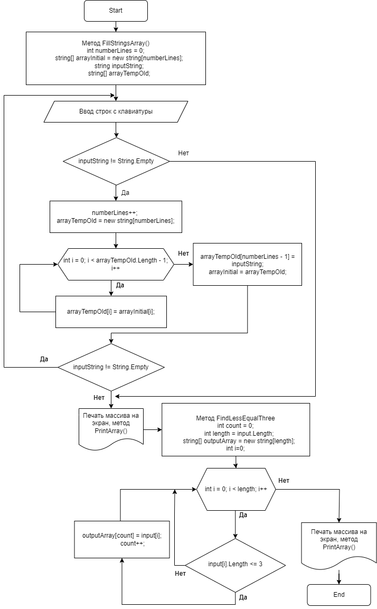

**Testwork1** C#

# __*Описание задачи*__

 Написать программу, которая из имеющегося массива строк
формирует массив из строк, длина которых меньше либо
равна 3 символа. Первоначальный массив можно ввести
с клавиатуры, либо задать на старте выполнения алгоритма.
-------------------------------
    При решении не рекомендуется пользоваться коллекциями, лучше обойтись исключительно массивами.

------------------------------------------------------

-----------------------------------------------------

# __*Алгоритм решения*__

1. __Рисуем блок схему выполнения алгоритма__
2. __Пишем метод заполнения строчного массива с клавиатуры__
3. __Пишем метод вывода массива на печать__
4. __Пишем метод сортировки меньше или равно 3-м символам__
5. __Выводим на печать введенный с клавиатуры массив__
6. __Выводим на печать массив из элементов согласно условиям задачи__
----------------------------

# __*<Блок схема>*__
